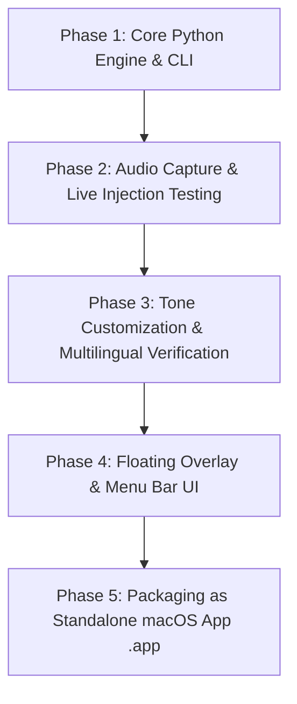

# Implementation Plan: Wispr Flow Alternative for macOS

Build an open-source, private, and highly responsive macOS dictation application inspired by **Wispr Flow**. It listens to speech via a global hotkey, performs multilingual speech-to-text with auto-detection, refines the text into user-selected tones via an LLM, seamlessly injects the result at the active cursor across any Mac application, and logs all transcriptions for later review.

---

## 1. Architecture & Technology Choices

### A. Speech-to-Text (STT) Engine (Open-Source & Free)
1. **Primary Local Engine: `mlx-whisper` (Apple Silicon optimized)**
   - Leverages Apple's MLX framework for unified memory on M-series chips.
   - Extremely fast transcription without heavy PyTorch overhead.
   - Models: `whisper-tiny`, `whisper-base`, `whisper-small`, `whisper-large-v3-turbo` (supports 99+ languages + auto language detection).
2. **Alternative Local Engine: `faster-whisper` / `whisper.cpp`**
   - High-throughput CTT2 quantization for universal CPU/GPU inference.
3. **Optional Fast Cloud Engine (Free Tier): Groq Whisper (`whisper-large-v3-turbo`)**
   - ~200-400ms turnaround time, perfect for instant dictation when internet is available.

### B. Tone Polishing & Context LLM Engine
Speech contains filler words (*"uh"*, *"um"*), false starts, and fragmented thoughts. The LLM cleans and reformulates the text into the chosen tone:
- **Tones supported:**
  1. *Smart Verbatim* (clean punctuation & capitalization, removes stutters, preserves exact words)
  2. *Casual / Chat* (friendly, concise, great for Slack/iMessage/WhatsApp)
  3. *Professional / Email* (well-structured, polite, corporate-ready)
  4. *Concise / Bullet Points* (executive summary, rapid notes)
  5. *Code & Technical* (preserves variable names, code blocks, technical terms)
  6. *Custom Persona / Instructions* (user-defined prompt)
- **Engines:**
  - **Local Open Source**: Ollama (`llama3.2:3b`, `qwen2.5:3b`, or `mistral`), or native `mlx-lm`.
  - **Free Cloud API**: Groq API (`llama-3.3-70b` / `llama-3.1-8b`, free rate-limits) or Gemini Flash API.

### C. macOS Active Cursor Text Injection
- **Universal Clipboard Injection with Instant Restoration**:
  1. Save current system clipboard (text/images).
  2. Write polished transcription to clipboard.
  3. Simulate `Cmd + V` via macOS `CGEvent` (CoreGraphics / PyObjC / pynput).
  4. Wait ~25ms and restore the previous clipboard content.
- Continuous mode: Appends at the active cursor without clearing or replacing previous text.
- Fallback: Accessibility API (`AXUIElementSetAttributeValue`) where supported.

### D. Audio Capture & Global Hotkey
- **Audio Capture**: `sounddevice` / `pyaudio` with 16kHz mono sampling and real-time silence detection (VAD - Voice Activity Detection via `webrtcvad` / `silero-vad`).
- **Global Hotkey**: `pynput` / `NSEvent.addGlobalMonitorForEventsMatchingMask` (e.g. Double-tap `Fn`, `Option + Space`, or custom hotkey) supporting both **Push-to-Talk** (hold while speaking) and **Toggle Mode** (tap to start, tap to stop).

### E. Storage & History
- Local SQLite database (`transcriptions.db`) storing:
  - Timestamp
  - Target application name (e.g. Slack, VS Code, Mail)
  - Audio duration & audio snippet path (optional)
  - Detected language
  - Selected tone
  - Raw transcription vs. Polished transcription

### F. Application UI (Mac Desktop)
- Built using **PyQt6 / PySide6** or native **Swift / SwiftUI** wrapper:
  - **Floating Dictation Pill** (Wispr Flow style): Minimalist pill displaying animated audio waveform/mic state, current tone indicator, and quick-cancel button.
  - **Menu Bar Tray**: Fast tone switcher, language picker (Auto vs specific), and settings.
  - **History & Settings Window**: Searchable transcription log, custom tone editor, audio device selector, and model selector.

---

## 2. Phased Roadmap (Iterative Approach)

Per your request to *"go one by one till I satisfy with the application before building it as a Mac application"*:



### Phase 1: Core Engine & Proof-of-Concept (Immediate Goal)
- Set up Python virtual environment (`.venv`).
- Implement audio recorder with VAD (Voice Activity Detection).
- Implement STT pipeline (modular: `mlx-whisper` / `faster-whisper` + Groq Whisper fallback).
- Implement Tone Rewriter & Context LLM (Ollama / Local LLM / Groq API).
- Implement universal macOS cursor insertion (`Cmd + V` buffer-swapping mechanism).
- Implement SQLite history store.
- Create an interactive CLI runner (`run_dictation.py`) to test and verify end-to-end dictation into any open app on your Mac.

### Phase 2: Fine-Tuning & Quality Optimization
- Test multilingual transcription & auto-language detection.
- Benchmark and tune response latency (streaming STT vs batch STT).
- Refine tone prompts (ensuring formatting matches tone without hallucinations).
- Test cross-app compatibility (Chrome, VS Code, Notes, Slack, Terminal).

### Phase 3: Desktop UI & Menu Bar App
- Build the floating macOS overlay pill (recording state, pulsing wave, tone badge).
- Build the Menu Bar app for tone switching and settings.
- Build the History viewer UI with search, copy, and export.

### Phase 4: Standalone macOS Bundle
- Package into native `.app` bundle with `py2app` or native wrapper so it runs automatically in the background without opening a terminal.

---

## 3. Proposed File Structure

```
Wispr_Flow_Alt/
├── config.py                 # Configuration (default tone, language, hotkey, models)
├── core/
│   ├── audio_recorder.py     # Microphone capture + VAD (sounddevice / numpy)
│   ├── stt_engine.py         # Speech-to-text (mlx-whisper / faster-whisper / groq)
│   ├── tone_processor.py     # LLM tone tuning & context preservation
│   ├── text_injector.py      # macOS active cursor injector (CGEvent Cmd+V swap)
│   └── database.py           # SQLite storage for transcriptions
├── tones/
│   └── prompts.json          # Customizable prompt templates for each tone
├── ui/                       # UI components (for Phase 3)
│   ├── floating_pill.py      # Floating overlay on recording
│   ├── menu_bar.py           # Status bar icon & quick tone switcher
│   └── history_view.py       # History viewer window
├── tests/
│   ├── test_stt.py           # Test STT on sample audio
│   └── test_tone.py          # Test tone rewriting
├── run_cli.py                # Command-line / Background service runner
└── requirements.txt          # Dependencies
```

---

## 4. Open Questions & Recommendations

> [!NOTE]
> **Open Source Model Recommendation**:
> 1. **STT**: `mlx-whisper` (model: `mlx-community/whisper-large-v3-turbo`) gives the highest accuracy across 99+ languages and runs directly on your Mac M-series chip with GPU acceleration. For cloud/instant fallback, Groq's Whisper API is free and takes ~300ms.
> 2. **Tone LLM**: Local Ollama running `llama3.2:3b` or `qwen2.5:3b` is lightweight (~2GB RAM), completely offline, and very fast on Apple Silicon. Alternatively, Groq's `llama-3.3-70b` (free tier) provides near-instant formatting.

> [!IMPORTANT]
> **macOS Permissions Required**:
> - **Microphone**: For audio recording.
> - **Accessibility**: For global hotkey listening and injecting text at active cursor (`System Settings -> Privacy & Security -> Accessibility`).

---

## 5. Verification Plan

### Step-by-Step Verification:
1. **Audio Recording Test**: Record 5 seconds of microphone audio and save to wav.
2. **STT & Multilingual Test**: Transcribe audio in English and another language (e.g. Tamil/Spanish/Hindi/French) with auto-detection.
3. **Tone Polishing Test**: Run raw transcript through all 5 tone profiles to verify output style.
4. **Active Cursor Injection Test**: Run background listener with hotkey, focus any text field (TextEdit, browser, or terminal), speak, and verify text appears at cursor without overwriting.
5. **Database Log Test**: Verify the transcription is stored with timestamp, raw text, and polished output.
